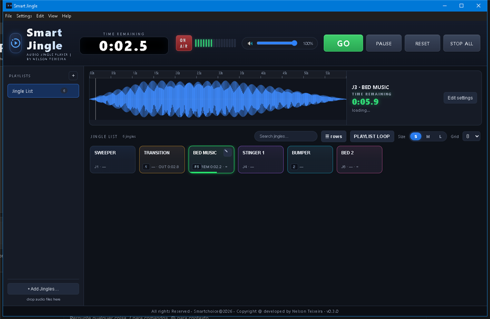
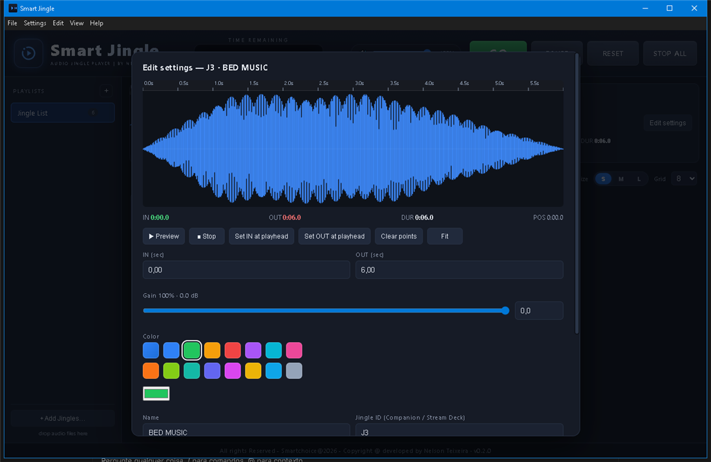
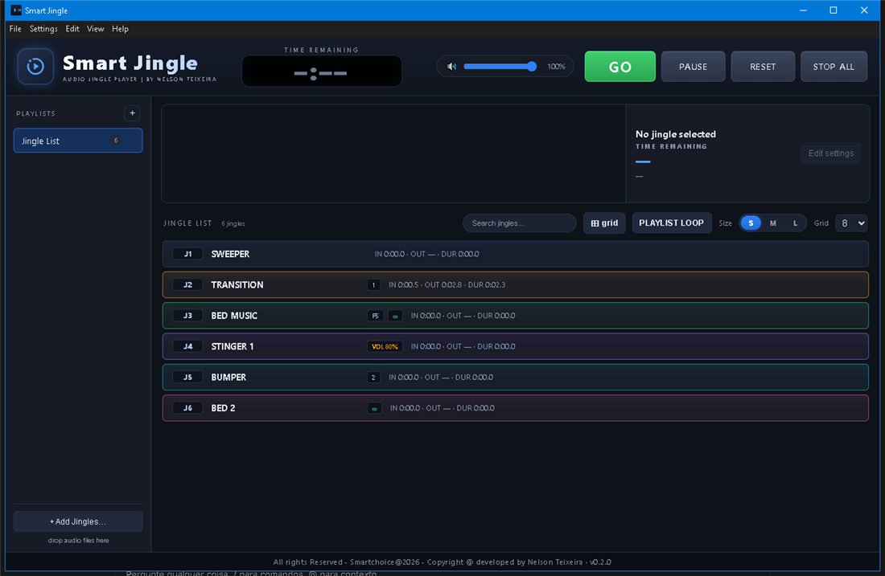

# Smart Jingle

Audio Jingle Player broadcast, Live/Corporate Events — launch jingles like hot cues,
edit IN/OUT points on a waveform, organise files in playlist groups, and control everything
remotely from a tablet, another PC or a Bitfocus Companion surface.

[](https://github.com/sharillas/Smart-Jingle/releases)
[]()
[]()
[]()
[](https://bitfocus.io/companion)
[]()

> All rights Reserved - Smartchoice@2026 - Copyright @ developed by Nelson Teixeira

## Screenshots / Style guide

### Main window (grid view) — BED MUSIC selected with its waveform



### Jingle "Edit settings" window (IN/OUT, gain dB, colour, ID, shortcut…)



### Rows view (for large jingle libraries)



## Features

- **QCart buttons** — left click plays instantly (polyphonic), right click cues/selects it,
  **GO** launches the cued jingle and advances to the next. Editable keyboard shortcuts
  (F1–F12, 0–9, A–Z) per jingle; F-keys and digits also work **system-wide**.
- **Fade in/out per jingle** — click-free transitions (ms, editable in Edit settings).
- **Retrigger lock** — per-jingle option to block re-triggering while playing.
- **VU meter + ON-AIR** — 16-segment LED level meter and ON-AIR indicator in the header.
- **Playlist loop** — toggle PLAYLIST LOOP to play the playlist continuously: when a jingle
  ends, the next one starts automatically (and wraps around).
- **Per-jingle playback mode** — each jingle can be set to *Play once (stop at OUT)* or
  *Loop* (jumps back to IN when reaching OUT, for beds/stingers).
- **Waveform bar** — live waveform overview with time ruler (mouse wheel zooms), playhead and
  a **TIME REMAINING** countdown for the jingle in play.
- **Jingle IDs** — every jingle gets an editable ID (`J1`, `J2`, … shown on the cart). Companion
  actions, feedbacks and variables use this ID, so Stream Deck buttons always target the right jingle.
- **IN / OUT editing** — drag green/red markers on the waveform, type exact seconds or
  use *Set IN/OUT at playhead* while previewing. Playback always respects the points.
- **Playlist groups** — organise jingles in multiple playlists (groups), drag & drop audio
  files, duplicate, rename, per-cart colours.
- **Transport** — GO (launch cued jingle + advance to next), PAUSE/RESUME, RESET, STOP ALL.
- **Remote server (API)** — built-in HTTP + WebSocket server: trigger jingles from an iPad,
  tablet or any PC. A ready-to-use web remote is served at `http://<host>:4405`.
- **Bitfocus Companion module** — `Smart-Jingle : by Nelson Teixeira` (`.tgz`) with preset
  buttons generated from the jingles configured in the GUI, plus GO/RESET/PAUSE/STOP ALL.
- **Modern dark UI** — blue / dark-grey template.
- **Auto-update check** — checks GitHub Releases on startup (and via Help → Check for Updates…);
  a banner appears when a new version is available.
- Installers for **Windows (.exe / .msi)** and **macOS (.dmg)**.

## Download & install

Get the latest installers from
[Releases](https://github.com/sharillas/Smart-Jingle/releases):

- Windows: `Smart.Jingle.Setup.<version>.exe` (or `.msi`)
- macOS: `Smart.Jingle-<version>-universal.dmg`
- Companion: `smart-jingle-<version>.tgz`

On first start the app creates a **Jingle List** playlist with 3 built-in
jingles (SWEEPER, TRANSITION, BED MUSIC) so you can try everything immediately.

### macOS Gatekeeper warning

The DMG is ad-hoc signed but not notarized yet (notarization requires an Apple
Developer ID). On first open macOS may show *"cannot be opened because Apple
cannot check it for malicious software"* — this is normal for open-source
unsigned apps. Bypass it once:

1. Right-click the app icon and choose **Open** → confirm **Open**,
   or run `xattr -cr "/Applications/Smart Jingle.app"` in Terminal.

To remove the warning entirely, build with a Developer ID and notarization
(see "Building releases" below).

## Remote API

| Method | Path | Action |
| ------ | ---- | ------ |
| GET  | `/api/state` | Full state (jingles, playlists, playing, transport) |
| GET  | `/api/info` | App info |
| POST | `/api/jingles/:id/play` | Launch jingle cart |
| POST | `/api/jingles/:id/stop` | Stop jingle cart |
| POST | `/api/transport/go` | GO — launch cued jingle + advance to next |
| POST | `/api/transport/pause` | PAUSE / RESUME all |
| POST | `/api/transport/reset` | RESET — stop all + clear selection |
| POST | `/api/transport/stop-all` | STOP ALL |
| POST | `/api/transport/loop-playlist` | Toggle playlist loop |
| POST | `/api/playlists/:id/activate` | Switch active playlist |
| WS   | `/ws` | Live state push (JSON `{type:"state", payload}`) |

Optional **PIN protection**: set a PIN in Settings; the API and web remote then require
`?pin=<pin>` (or header `x-smart-jingle-pin`) and return `401` otherwise.

## OSC

UDP OSC server (Settings → enable, default port **4410**):

| Address | Args | Action |
| ------- | ---- | ------ |
| `/jingle/<id>` | `1`/`0` | Play / stop jingle (by Jingle ID) |
| `/transport/<cmd>` | `1` | `go`, `pause`, `reset`, `stop-all`, `loop-playlist` |
| `/playlist/<id>` | `1` | Activate playlist |

Web remote (tablet friendly): `http://<host-ip>:4405/`

Default port: **4405** (change in *Settings*; restart required).

## Backups

The data file (`smart-jingle-data.json`) is automatically backed up every minute of changes
(5 rotating copies) in `userData/backups/`.

## Companion module

In Companion: *Settings → Modules → Import module* and pick `smart-jingle-<version>.tgz`.
Add a connection with the Smart Jingle machine IP and port 4405. Presets are generated
automatically from the jingles configured in the app GUI:

- `Transport (GO/PAUSE/RESET/STOP)`
- `Jingles 1-8`, `Jingles 9-16`, … (one button per jingle, green when playing, blue when selected)

Actions: Play Jingle, Stop Jingle, Transport, Select Playlist.
Feedbacks: playing, selected, paused, connected. Variables: per-jingle status, transport
state, active playlist.

## Development

```bash
npm install
npm start              # run the app
npm run dist:win       # build exe + msi
npm run dist:mac       # build dmg (on macOS)
npm run pack:companion # pack companion module into release/companion/
powershell -ExecutionPolicy Bypass -File scripts/gen-icon.ps1   # regenerate icons
```

Data (playlists/jingles/settings) is stored in `smart-jingle-data.json` in the OS
user-data folder (File → Reveal Data File).

## Building releases

Push a tag `v*` (e.g. `v0.2.0`) — GitHub Actions builds the Windows and macOS
installers plus the Companion `.tgz` and attaches everything to the release.

To fully sign and notarize the macOS build (removes the Gatekeeper warning),
add these secrets to the repository and enable the commented lines in
`.github/workflows/build.yml`, then set `"hardenedRuntime": true` in `build.mac`:

- `CSC_LINK` (base64 of the Developer ID .p12) and `CSC_KEY_PASSWORD`
- `APPLE_ID`, `APPLE_APP_SPECIFIC_PASSWORD`, `APPLE_TEAM_ID`

## License

Proprietary software — **All rights Reserved**.

```
All rights Reserved - Smartchoice@2026 - Copyright @ developed by Nelson Teixeira
```

Copyright © 2026 Nelson Teixeira, Smartchoice. No part of this software may be
copied, modified, distributed or used without prior written permission.
See [LICENSE](LICENSE) for details.
